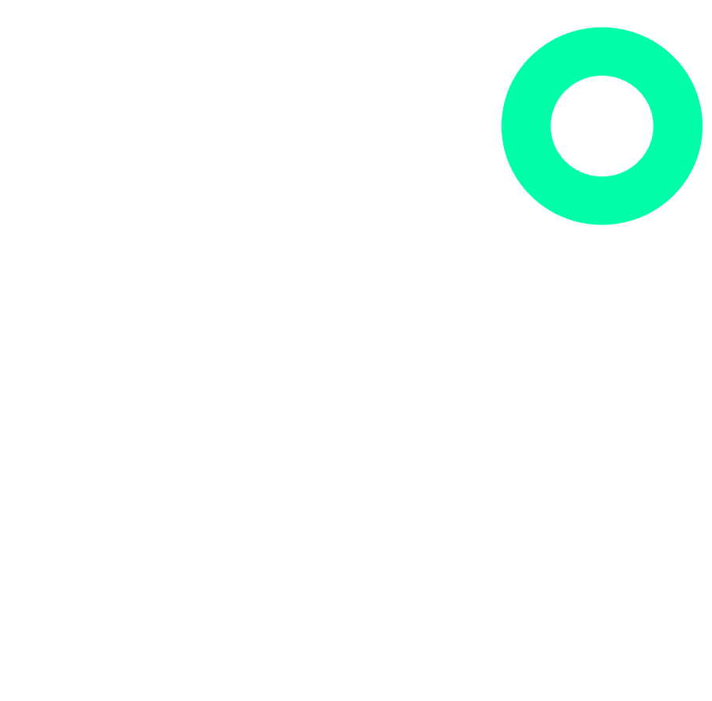

<h1 align="center">
  
</h1><br>

# Validation Metrics Library

[](https://pypi.org/project/gesund)
[](
https://pypi.org/project/gesund/)


This library provides tools for calculating validation metrics for predictions and annotations in machine learning workflows. It includes a command-line tool for computing and displaying validation metrics.

- **Documentation:**  https://gesund-ai.github.io
- **Source code:** https://github.com/gesund-ai/gesund
- **Bug reports:** https://github.com/gesund-ai/gesund/issues
- **Examples :** https://github.com/gesund-ai/gesund/tree/main/gesund/examples


## Installation

To use this library, ensure you have the necessary dependencies installed in your environment. You can install them via `pip`:

```sh
pip install gesund
```

## Code of Conduct


We are committed to fostering a welcoming and inclusive community. Please adhere to the following guidelines when contributing to this project:

- **Respect**: Treat everyone with respect and consideration. Harassment or discrimination of any kind is not tolerated.
- **Collaboration**: Be open to collaboration and constructive criticism. Offer feedback gracefully and accept feedback in the same manner.
- **Inclusivity**: Use inclusive language and be mindful of different perspectives and experiences.
- **Professionalism**: Maintain a professional attitude in all project interactions.

By participating in this project, you agree to abide by this Code of Conduct. If you witness or experience any behavior that violates these guidelines, please contact the project maintainers.

## License

This project is licensed under the MIT License. See the [LICENSE](LICENSE) file for details.

## Call for Contributions

We welcome contributions from the community! If you're interested in enhancing this library or fixing issues, please follow these steps:

- **Fork** the repository.
- **Create** a new branch for your feature or bug fix.
- **Commit** your changes with clear and descriptive messages.
- **Push** your changes to your forked repository.
- **Submit** a pull request for review.

Please ensure your code adheres to the project's coding standards and includes appropriate tests. Thank you for your contributions!
